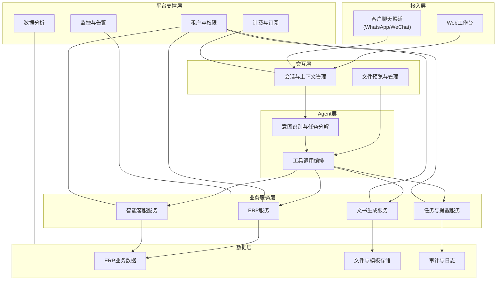
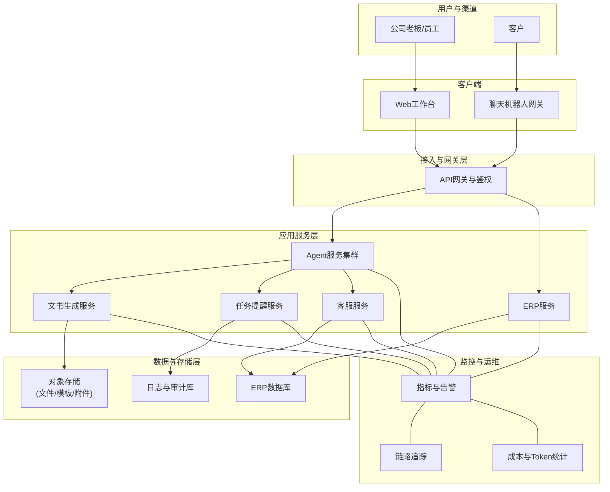

# AI外贸助手架构图（系统与部署）

## 系统架构图

```mermaid
flowchart TB
  subgraph Access["接入层"]
    Web["Web工作台"]
    Chat["客户聊天渠道\n(WhatsApp/WeChat)"]
  end

  subgraph Interaction["交互层"]
    Session["会话与上下文管理"]
    Viewer["文件预览与管理"]
  end

  subgraph Agent["Agent层"]
    Intent["意图识别与任务分解"]
    Orchestrator["工具调用编排"]
  end

  subgraph Services["业务服务层"]
    ERP["ERP服务"]
    Docs["文书生成服务"]
    Task["任务与提醒服务"]
    CS["智能客服服务"]
  end

  subgraph Platform["平台支撑层"]
    Auth["租户与权限"]
    Billing["计费与订阅"]
    Observability["监控与告警"]
    Analytics["数据分析"]
  end

  subgraph Data["数据层"]
    ERPDB["ERP业务数据"]
    FileStore["文件与模板存储"]
    Audit["审计与日志"]
  end

  Web --> Session
  Chat --> Session
  Session --> Intent
  Viewer --> Orchestrator
  Intent --> Orchestrator
  Orchestrator --> ERP
  Orchestrator --> Docs
  Orchestrator --> Task
  Orchestrator --> CS

  ERP --> ERPDB
  Docs --> FileStore
  Task --> Audit
  CS --> ERPDB

  Auth --- ERP
  Auth --- Docs
  Auth --- Task
  Auth --- CS

  Billing --- Session
  Observability --- Services
  Analytics --- Data
```

## 部署架构图

```mermaid
flowchart TB
  subgraph Users["用户与渠道"]
    Boss["公司老板/员工"]
    Customer["客户"]
  end

  subgraph Clients["客户端"]
    WebApp["Web工作台"]
    Bot["聊天机器人网关"]
  end

  subgraph Gateway["接入与网关层"]
    APIGW["API网关与鉴权"]
  end

  subgraph App["应用服务层"]
    AgentSvc["Agent服务集群"]
    ERPSvc["ERP服务"]
    DocSvc["文书生成服务"]
    TaskSvc["任务提醒服务"]
    CSSvc["客服服务"]
  end

  subgraph Data["数据与存储层"]
    ERPDB["ERP数据库"]
    ObjectStore["对象存储\n(文件/模板/附件)"]
    LogStore["日志与审计库"]
  end

  subgraph Ops["监控与运维"]
    Monitor["指标与告警"]
    Trace["链路追踪"]
    Cost["成本与Token统计"]
  end

  Boss --> WebApp
  Customer --> Bot
  WebApp --> APIGW
  Bot --> APIGW

  APIGW --> AgentSvc
  APIGW --> ERPSvc
  AgentSvc --> DocSvc
  AgentSvc --> TaskSvc
  AgentSvc --> CSSvc

  ERPSvc --> ERPDB
  DocSvc --> ObjectStore
  TaskSvc --> LogStore
  CSSvc --> ERPDB

  AgentSvc --- Monitor
  ERPSvc --- Monitor
  DocSvc --- Monitor
  TaskSvc --- Monitor
  CSSvc --- Monitor
  Monitor --- Trace
  Monitor --- Cost
```
