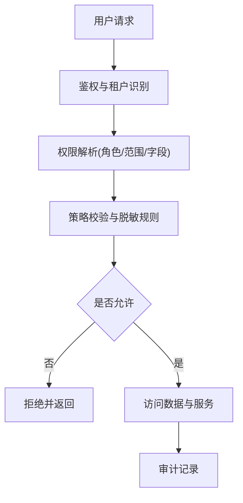
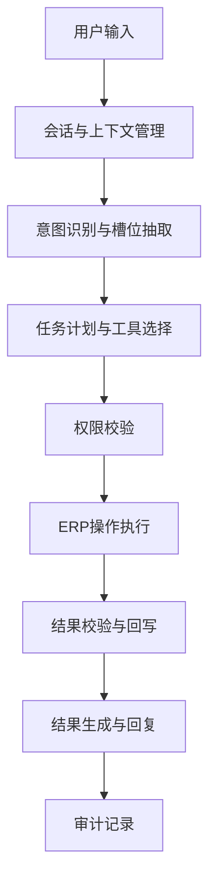
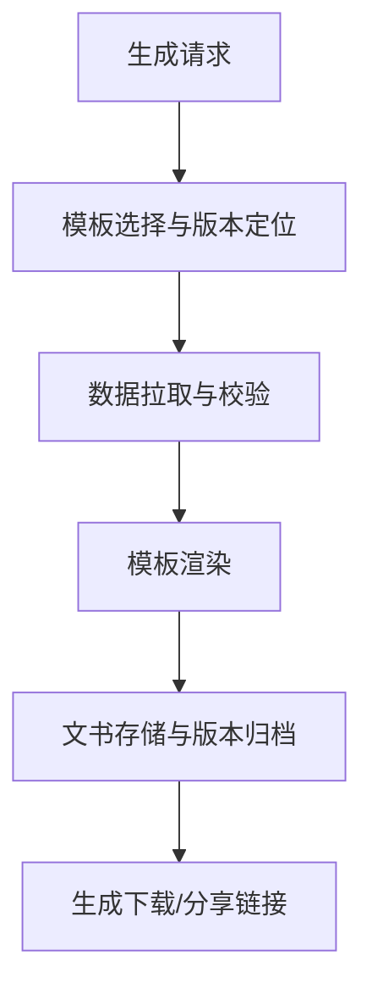
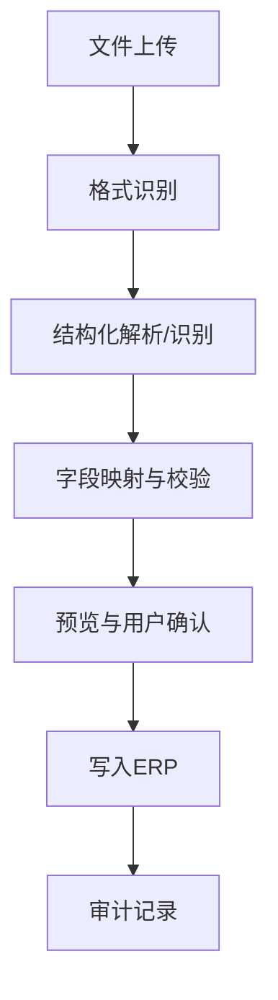
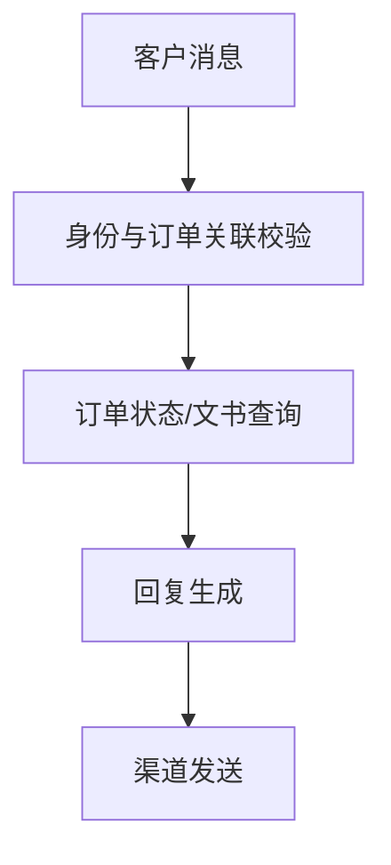
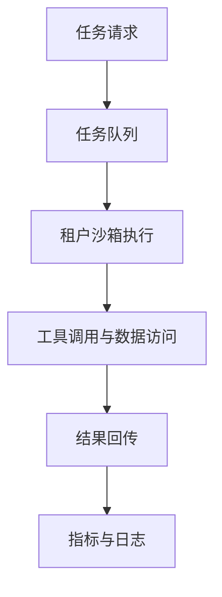

# AI外贸助手技术细节设计（含流程图）

## 文档范围
1. 补充整体架构的关键技术方案与实现方式
2. 以流程图方式描述关键链路
3. 不包含具体代码与供应商选型细节

## 技术方案概览
1. 多租户隔离与权限控制
2. 自然语言指令到ERP操作的执行链路
3. 文书模板生成与版本管理
4. 数据导入与结构化入库
5. 客户侧智能客服链路
6. Agent沙箱隔离与可观测

## 关键技术方案与流程图

### 1. 多租户隔离与权限控制

#### 流程图

#### 技术实现方式
1. 租户隔离：所有业务数据以tenant_id作为强制分区维度，读写接口必须携带并校验tenant_id
2. 权限模型：角色(老板/员工/客户) + 资源范围(模块/客户/订单) + 字段级权限
3. 权限执行：在API网关与业务服务内双重校验，返回数据前进行字段脱敏
4. 审计日志：所有写操作与敏感读取记录审计信息与操作人

### 2. 自然语言指令到ERP操作链路

#### 流程图

#### 技术实现方式
1. 会话层保存上下文、用户角色与当前订单/客户范围
2. 意图识别输出结构化任务计划，包含操作类型与目标实体
3. 工具调用采用受控API，所有写操作走审批级别规则
4. 结果校验采用读后验证，确保ERP状态与响应一致

### 3. 文书模板生成与版本管理

#### 流程图

#### 技术实现方式
1. 模板管理：按租户保存模板，支持版本号与状态管理
2. 数据对齐：模板字段与ERP字段映射表，缺失字段给出提示
3. 渲染产物：文书生成后存入对象存储，生成可控时效链接
4. 追溯：生成记录包含模板版本、数据快照与操作人

### 4. 数据导入与结构化入库

#### 流程图

#### 技术实现方式
1. 支持Excel/图片/PDF/邮件附件多来源导入
2. 解析后生成字段映射建议，支持人工修正
3. 写入ERP前提供差异预览与确认机制
4. 写入后生成可回滚的入库批次记录

### 5. 客户侧智能客服链路

#### 流程图

#### 技术实现方式
1. 客户身份与订单绑定，避免越权查询
2. 只提供订单状态、进度、文书下载等有限能力
3. 回复内容支持模板化，避免敏感信息泄露

### 6. Agent沙箱隔离与可观测

#### 流程图

#### 技术实现方式
1. Agent按租户隔离执行环境，限制资源与访问范围
2. 工具调用统一网关，记录耗时与成本
3. 指标采集覆盖成功率、QPS、耗时、Token与失败原因

## 关键数据模型（概念级）
1. Tenant：租户信息与订阅状态
2. User：角色与权限范围
3. Customer/Order：外贸核心业务实体
4. Document：模板与生成文书
5. AuditLog：操作审计

## 与现有文档的对应关系
1. 对应总体架构分层与模块说明：tech-architecture.md
2. 关键链路流程图与实现细节补充：本文件
