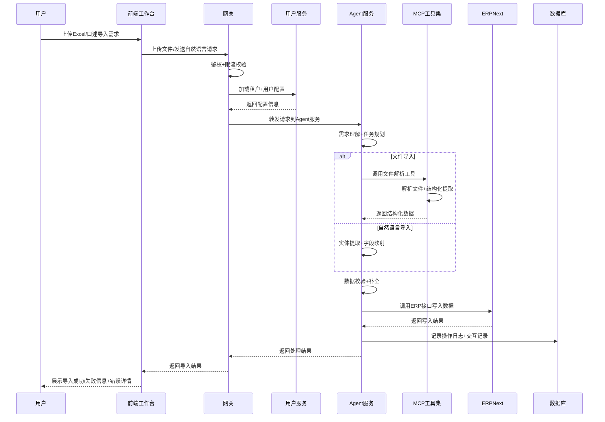
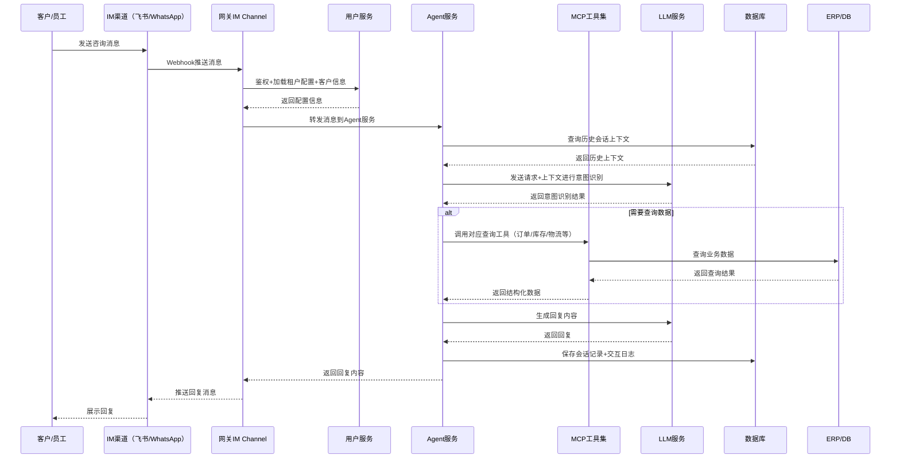
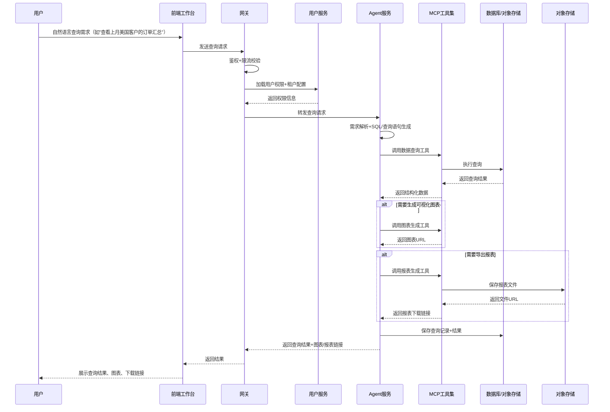

## 目标与价值

### 目标

1. 将外贸公司零散的本地表格与文档数据快速结构化进入ERP系统
2. 通过自然语言降低ERP操作门槛，提高数据录入、查询与文书产出的效率
3. 形成可追踪、可审计、可复用的数据与流程闭环
4. 基于数据形成智能客服，解决询盘、订单答疑等问题
5. 基于数据实现自动推广、投流等能力。

### 目标用户

1. 小微外贸公司老板（1-5人团队）
2. 公司员工（跟单、采购、财务、仓储）
3. 客户（仅查询与自身订单相关信息）

# 整体架构

## 技术链路

# 各功能模块详细设计

### 前端侧模块

#### 1. 多端工作台（PC Workbench + 移动端APP）

- **核心能力**：
  - 聊天交互界面：支持自然语言对话、多模态输入（文本/图片/文件/语音）
  - 数据看板：多维度业务数据可视化（订单量、询盘转化率、库存预警、营收统计）
  - 文件管理：支持Excel/CSV/PDF/图片等格式的上传、预览、解析、导出
  - 租户管理：企业信息配置、用户权限分配、套餐管理、充值消费记录
  - 浏览器操作能力：支持自动化网页操作（电商平台数据同步、物流信息查询、报关单填报等）
- **技术实现**：React + TypeScript 构建PC端，Flutter 实现跨端移动端，支持PWA离线访问
- **适配特性**：响应式布局，支持小屏折叠显示，针对移动端做交互精简

#### 2. IM软件接入

- **支持渠道**：飞书、WhatsApp、微信、钉钉等主流企业沟通工具
- **核心能力**：
  - 智能客服自动回复：基于用户历史对话和业务数据，自动解答询盘、订单进度、物流信息等常见问题
  - 会话转接：复杂问题自动识别并转人工处理，附带完整上下文信息
  - 聊天记录分析：自动提取对话中的关键信息（客户需求、订单意向、投诉问题）同步到ERP系统
- **技术实现**：基于各平台OpenAPI开发Webhook接入，消息统一适配层转换为平台标准格式

#### 3. 后台管理页面

- **核心能力**：
  - 系统配置：LLM模型参数、工具权限、敏感词过滤规则、API配额管理
  - 运营监控：租户活跃统计、请求量监控、错误日志查询、token消耗统计
  - 权限管理：超级管理员、运营人员、普通租户的权限分配
  - 审计日志：全操作轨迹可追溯，支持合规审计

### 网关侧（Gateway）

#### 1. 鉴权模块

- **实现方式**：JWT Token 鉴权 + 租户级密钥校验
- **能力特性**：
  - 多端统一鉴权：PC/APP/IM/后台管理页面共用一套鉴权体系
  - 权限粒度控制：接口级、功能级、数据级三级权限校验
  - 会话有效期管理：支持自动续期、多设备登录管理、强制下线能力

#### 2. 限流模块

- **限流策略**：租户级API QPS限流 + 租户级LLM chat QPM限流
- **能力特性**：
  - 动态调整：支持根据租户套餐等级动态调整限流阈值

#### 3. IM Channel

- **核心能力**：
  - 长连接管理：维护IM消息的长连接通道，支持消息推送、已读回执、离线消息存储
  - 消息路由：根据消息来源渠道和接收者，自动路由到对应的处理服务
  - 消息幂等：重复消息自动去重，保障消息处理一致性

#### 4. 多端兼容适配层

- **核心能力**：
  - 输入统一转换：将不同端的输入格式（语音/图片/文件/结构化数据）统一转换为服务层标准格式
  - 输出自适应：根据端能力自动适配返回格式（富文本/卡片/纯文本/语音）
  - 版本兼容：支持多版本客户端同时在线，旧版本客户端自动兼容新接口

### 核心逻辑层

#### 1. 用户服务模块

- **租户管理**
  - 企业信息维护：公司名称、地址、联系方式、业务类型、海关编码等基础信息
  - 租户配置：个性化配置（回复风格、工作时间、多语言支持、敏感词规则）
  - 套餐管理：版本等级（基础版/专业版/企业版）、功能权限、API配额、有效期管理
- **用户管理**
  - 账号体系：手机号/邮箱登录，角色权限分配（老板/跟单/采购/财务/仓储/客户）
  - 权限控制：数据权限隔离，不同角色只能查看和操作权限范围内的数据
- **会员/优惠/充值管理**
  - 计费体系：按月订阅计费|包含多种套餐
  - 充值消费：支持线上充值、消费记录查询、发票申请
  - 优惠体系：新用户折扣、邀请用户折扣、按年订阅折扣等

#### 2. Agent服务模块（基于DeerFlow框架）

- **Agent循环引擎**
  - 规划能力：根据用户需求自动拆解任务、规划执行步骤
  - 工具调用：动态选择合适的工具执行任务，支持多工具串联执行
  - 反思优化：执行过程中自动评估结果，出错时自动重试或调整策略
  - 结果整理：将工具返回的结构化/非结构化结果整理为自然语言回答
- **MCP/Skill工具管理**
  - 内置工具集：文件解析、ERP操作、数据查询、网页浏览、邮件发送、报表生成等
  - 自定义工具：支持租户上传自定义工具脚本，满足个性化业务需求
  - 工具权限：租户级工具使用权限控制，敏感操作需要审批
- **Token记录模块**
  - 消耗统计：按对话、按用户、按租户多维度统计token消耗
  - 成本核算：实时计算每次请求的成本，作为计费依据
  - 消耗预警：租户token消耗达到阈值时自动发送预警通知
- **Sandbox管理**
  - 隔离环境：每个工具执行在独立的沙箱环境中，避免相互影响
  - 资源限制：CPU、内存、执行时间限制，防止恶意代码或死循环影响系统稳定性
  - 执行审计：所有沙箱执行操作记录日志，支持回溯审计
- **会话/状态管理**
  - 上下文管理：多轮对话上下文持久化存储，支持会话中断后恢复
  - 状态持久化：工具执行过程中的中间状态自动保存，故障重启后可继续执行
  - 会话归档：历史会话自动归档，支持查询和导出
- **交互记录模块**
  - 全量存储：所有用户交互、Agent执行过程、工具调用结果全量存储
  - 标注能力：支持对交互结果进行人工标注，用于模型微调优化
  - 数据分析：对话效果分析、用户需求分布、工具调用成功率等统计分析

### 基础层模块

#### 1. 存储服务

- **PostgreSQL**
  - 存储结构化数据：租户信息、用户信息、订单数据、商品数据、客户数据、配置信息等
  - 设计原则：租户隔离（行级隔离）、索引优化、读写分离
- **Redis**
  - 缓存场景：会话信息、热点数据、接口限流、分布式锁
  - 持久化策略：关键数据RDB+AOF混合持久化，非关键数据仅内存存储
- **对象存储**
  - 存储非结构化数据：用户上传的文件、图片、语音、生成的报表、导出的数据等
  - 能力特性：多版本管理、生命周期自动清理、跨区域备份

#### 2. 外部依赖服务

- **AIOSandbox**
  - 安全执行环境：用于执行用户自定义代码、网页自动化操作、第三方工具调用等
  - 安全机制：网络隔离、系统调用限制、资源配额限制
- **ERPNext**
  - 核心业务系统：外贸全流程管理（商品、采购、销售、库存、财务、报关等）
  - 集成方式：REST API 双向同步，数据变更实时通知
- **LLM服务**
  - 支持多模型： Claude 3/GPT-4/通义千问/文心一言等主流大模型
  - 路由策略：根据任务类型自动选择最合适的模型，支持降级切换

# 核心链路时序图

### 1. 自然语言数据导入ERP链路

*（原文档白板时序图，导出后为占位符，可参考原文档查看）*

### 2. 智能客服会话处理链路

*（原文档白板时序图，导出后为占位符，可参考原文档查看）*

### 3. 数据查询分析链路

*（原文档白板时序图，导出后为占位符，可参考原文档查看）*

# 数据库表设计

### 核心系统表（PostgreSQL）

#### 1. 租户信息表 `tenant`

| 字段名            | 类型         | 说明                             | 约束                               |
| ----------------- | ------------ | -------------------------------- | ---------------------------------- |
| id                | bigint       | 租户ID                           | PRIMARY KEY                        |
| name              | varchar(128) | 公司名称                         | NOT NULL                           |
| contact_name      | varchar(64)  | 联系人姓名                       |                                    |
| contact_phone     | varchar(32)  | 联系电话                         | NOT NULL                           |
| contact_email     | varchar(128) | 联系邮箱                         |                                    |
| package_level     | varchar(32)  | 套餐等级（basic/pro/enterprise） | NOT NULL DEFAULT 'basic'           |
| package_expire_at | timestamp    | 套餐到期时间                     |                                    |
| lmm_query_qpm     | bigint       | LLM query qpm限制                | NOT NULL DEFAULT 0                 |
| status            | smallint     | 状态（0=禁用 1=正常 2=试用）     | NOT NULL DEFAULT 1                 |
| created_at        | timestamp    | 创建时间                         | NOT NULL DEFAULT CURRENT_TIMESTAMP |
| updated_at        | timestamp    | 更新时间                         | NOT NULL DEFAULT CURRENT_TIMESTAMP |

#### 2. 用户信息表 `user`

| 字段名        | 类型         | 说明                                    | 约束                               |
| ------------- | ------------ | --------------------------------------- | ---------------------------------- |
| id            | bigint       | 用户ID                                  | PRIMARY KEY                        |
| tenant_id     | bigint       | 所属租户ID                              | NOT NULL, INDEX                    |
| username      | varchar(64)  | 用户名                                  | NOT NULL, UNIQUE                   |
| password_hash | varchar(256) | 密码哈希                                |                                    |
| real_name     | varchar(64)  | 真实姓名                                |                                    |
| phone         | varchar(32)  | 手机号                                  | NOT NULL                           |
| email         | varchar(128) | 邮箱                                    |                                    |
| role          | varchar(32)  | 角色（admin/manager/employee/customer） | NOT NULL                           |
| avatar        | varchar(256) | 头像URL                                 |                                    |
| status        | smallint     | 状态（0=禁用 1=正常）                   | NOT NULL DEFAULT 1                 |
| last_login_at | timestamp    | 最后登录时间                            |                                    |
| created_at    | timestamp    | 创建时间                                | NOT NULL DEFAULT CURRENT_TIMESTAMP |
| updated_at    | timestamp    | 更新时间                                | NOT NULL DEFAULT CURRENT_TIMESTAMP |

#### 3. 会话表 `session`

| 字段名          | 类型         | 说明                               | 约束                               |
| --------------- | ------------ | ---------------------------------- | ---------------------------------- |
| id              | bigint       | 会话ID                             | PRIMARY KEY                        |
| tenant_id       | bigint       | 租户ID                             | NOT NULL, INDEX                    |
| user_id         | bigint       | 用户ID                             | NOT NULL, INDEX                    |
| customer_id     | bigint       | 客户ID（客户咨询时关联）           | INDEX                              |
| channel         | varchar(32)  | 渠道（pc/app/feishu/whatsapp/web） | NOT NULL                           |
| title           | varchar(256) | 会话标题                           |                                    |
| status          | smallint     | 状态（0=已结束 1=进行中）          | NOT NULL DEFAULT 1                 |
| seesion_id      | varchar(64)  | agent记录的会话id                  | DEFAULT '{}'::jsonb                |
| last_message_at | timestamp    | 最后消息时间                       | NOT NULL                           |
| created_at      | timestamp    | 创建时间                           | NOT NULL DEFAULT CURRENT_TIMESTAMP |
| updated_at      | timestamp    | 更新时间                           | NOT NULL DEFAULT CURRENT_TIMESTAMP |

#### 4. Token消耗记录表 `token_record`

| 字段名        | 类型        | 说明        | 约束                               |
| ------------- | ----------- | ----------- | ---------------------------------- |
| id            | bigint      | 记录ID      | PRIMARY KEY                        |
| tenant_id     | bigint      | 租户ID      | NOT NULL, INDEX                    |
| user_id       | bigint      | 用户ID      | NOT NULL, INDEX                    |
| session_id    | varchar(64) | 会话ID      | INDEX                              |
| round         | bigint      | 对话轮次    | NOT NULL                           |
| model         | varchar(64) | 使用的模型  | NOT NULL                           |
| input_tokens  | bigint      | 输入token数 | NOT NULL DEFAULT 0                 |
| output_tokens | bigint      | 输出token数 | NOT NULL DEFAULT 0                 |
| total_tokens  | bigint      | 总token数   | NOT NULL DEFAULT 0                 |
| created_at    | timestamp   | 创建时间    | NOT NULL DEFAULT CURRENT_TIMESTAMP |

#### 5. 订阅记录表 `transaction`

| 字段名     | 类型          | 说明                              | 约束                               |
| ---------- | ------------- | --------------------------------- | ---------------------------------- |
| id         | bigint        | 交易ID                            | PRIMARY KEY                        |
| tenant_id  | bigint        | 租户ID                            | NOT NULL, INDEX                    |
| type       | smallint      | 交易类型（1=单次订阅 2=自动续费） | NOT NULL                           |
| amount     | decimal(10,2) | 交易金额                          | NOT NULL                           |
| duration   | int           | 订阅时长(单位月)                  | NOT NULL                           |
| remark     | varchar(256)  | 备注                              |                                    |
| operator   | bigint        | 操作人ID                          |                                    |
| created_at | timestamp     | 创建时间                          | NOT NULL DEFAULT CURRENT_TIMESTAMP |
| end_at     | timestamp     | 订阅停止时间                      |                                    |

# 开发任务拆解和优先级排序

### 优先级定义

| 优先级 | 说明         | 要求                                               |
| ------ | ------------ | -------------------------------------------------- |
| P0     | 核心阻塞任务 | 必须优先完成，未完成则整个项目无法推进             |
| P1     | 版本必备功能 | MVP/正式版本必须包含的功能                         |
| P2     | 重要优化功能 | 提升用户体验、系统稳定性的功能，可在版本上线后迭代 |
| P3     | 长期规划功能 | 未来版本规划的功能，不影响当前版本上线             |

---

### 第一阶段：MVP版本（4周，核心可用）

目标：实现最小可用版本，支持核心数据导入、基础自然语言查询、ERP集成能力，满足1-2个试点租户使用

| 任务模块           | 具体任务                                                   | 优先级 | 预估工时 | 依赖任务               |
| ------------------ | ---------------------------------------------------------- | ------ | -------- | ---------------------- |
| **基础架构** | 项目初始化（前后端工程结构、CI/CD流程、开发环境搭建）      | P0     | 3人天    | -                      |
|                    | 网关服务开发（鉴权、限流、基础路由）                       | P0     | 5人天    | 项目初始化             |
|                    | 数据库表结构设计与初始化                                   | P0     | 2人天    | 项目初始化             |
|                    | 用户服务开发（租户管理、用户管理、权限控制）               | P0     | 7人天    | 数据库表初始化         |
|                    | Agent服务基础框架搭建（基于DeerFlow，Agent循环、会话管理） | P0     | 8人天    | 项目初始化             |
| **核心功能** | ERPNext集成开发（数据读写接口、双向同步机制）              | P0     | 6人天    | 数据库表初始化         |
|                    | MCP工具集-基础工具开发（文件解析、数据查询、ERP操作）      | P0     | 10人天   | Agent框架搭建          |
|                    | 沙箱执行环境集成（AIOSandbox对接、安全策略配置）           | P0     | 4人天    | Agent框架搭建          |
|                    | LLM服务对接（多模型支持、路由策略、token消耗统计）         | P0     | 5人天    | Agent框架搭建          |
| **前端**     | PC端工作台基础版（聊天界面、文件上传、基础数据展示）       | P1     | 10人天   | 接口定义完成           |
|                    | 后台管理页面基础版（租户管理、系统配置、监控看板）         | P1     | 8人天    | 接口定义完成           |
| **联调测试** | 核心链路联调（文件导入ERP、自然语言查询）                  | P0     | 5人天    | 前后端核心功能开发完成 |
|                    | 试点租户对接测试                                           | P1     | 3人天    | 联调完成               |
|                    | 安全测试（鉴权、数据隔离、沙箱安全）                       | P1     | 3人天    | 联调完成               |

---

### 第二阶段：1.0正式版本（6周，全功能可用）

目标：完成所有核心功能，支持多租户商业化运营，满足小微外贸公司全场景需求

| 任务模块           | 具体任务                                               | 优先级 | 预估工时 | 依赖任务     |
| ------------------ | ------------------------------------------------------ | ------ | -------- | ------------ |
| **功能迭代** | IM渠道接入（飞书、WhatsApp、智能客服能力）             | P0     | 10人天   | MVP版本完成  |
|                    | 自定义工具能力（租户上传自定义工具、权限控制）         | P1     | 8人天    | MVP版本完成  |
|                    | 数据看板与可视化能力（多维度业务报表、图表生成）       | P1     | 7人天    | MVP版本完成  |
|                    | 计费系统开发（套餐管理、充值消费、账单生成）           | P1     | 6人天    | 用户服务完成 |
|                    | 自动化流程能力（订单自动跟进、库存预警、邮件自动发送） | P2     | 8人天    | 核心功能完成 |
| **前端**     | 移动端APP开发（核心功能适配移动端）                    | P1     | 12人天   | PC端功能稳定 |
|                    | 客户自助查询门户                                       | P2     | 7人天    | 核心功能完成 |
| **系统能力** | 多租户数据隔离优化（行级安全、备份恢复策略）           | P0     | 4人天    | MVP版本完成  |
|                    | 监控告警系统（链路追踪、错误告警、性能监控）           | P1     | 5人天    | MVP版本完成  |
|                    | 高可用优化（读写分离、缓存策略、降级熔断机制）         | P1     | 6人天    | MVP版本完成  |
| **商业化**   | 运营后台完善（租户运营分析、工单系统、权限管理）       | P1     | 7人天    | 计费系统完成 |
|                    | 租户自助注册、支付对接                                 | P1     | 5人天    | 计费系统完成 |
| **测试**     | 全功能回归测试、性能压测                               | P0     | 5人天    | 功能开发完成 |
|                    | 安全合规审计（数据安全、跨境传输合规）                 | P1     | 3人天    | 功能开发完成 |

---

### 第三阶段：2.0智能版本（8周，AI能力升级）

目标：强化AI能力，实现智能决策、自动化运营，提升产品核心竞争力

| 任务模块             | 具体任务                                           | 优先级 | 预估工时 | 依赖任务           |
| -------------------- | -------------------------------------------------- | ------ | -------- | ------------------ |
| **AI能力**     | 智能客服优化（知识库训练、多轮对话理解、情绪识别） | P1     | 8人天    | 1.0版本完成        |
|                      | 需求预测（基于历史数据预测销量、库存需求）         | P2     | 10人天   | 1.0版本数据积累    |
|                      | 智能推荐（商品推荐、客户跟进建议、营销策略推荐）   | P2     | 7人天    | 1.0版本数据积累    |
| **自动化能力** | 自动推广投流能力（电商平台自动上架、广告投放优化） | P2     | 12人天   | 浏览器操作工具稳定 |
|                      | 报关、物流自动化对接                               | P2     | 9人天    | ERP集成稳定        |
| **生态能力**   | Open API开放平台（第三方系统对接、ISV生态）        | P2     | 10人天   | 1.0版本稳定        |
|                      | 市场模板中心（行业解决方案模板、自定义流程模板）   | P3     | 6人天    | 自定义工具能力完成 |

---

### 里程碑计划

| 里程碑          | 时间   | 交付标准                        |
| --------------- | ------ | ------------------------------- |
| 需求评审完成    | 第1周  | 需求文档、架构设计文档评审通过  |
| MVP版本上线     | 第5周  | 核心链路跑通，支持试点租户使用  |
| 1.0版本灰度     | 第11周 | 全功能可用，支持50+租户同时使用 |
| 1.0版本正式发布 | 第12周 | 商业化上线，对外开放注册使用    |
| 2.0版本发布     | 第20周 | 智能能力上线，形成差异化竞争力  |
